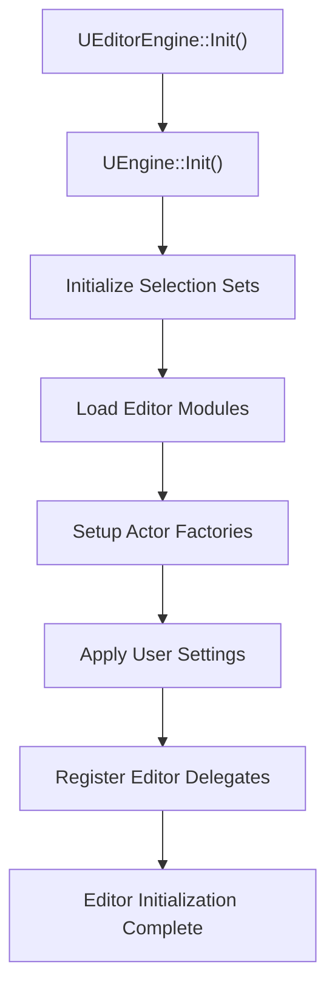

## Add to Chrome
open chrome://extensions/

click "load unpacked extension"

## Test
https://deepwiki.com/unrealengine47/UnrealEngine4/3.1-engine-initialization

Result:

```mermaid
flowchart TD
    Start["UEditorEngine::Init()"] --> BaseInit["UEngine::Init()"]
    BaseInit --> SelectionSets["Initialize Selection Sets"]
    SelectionSets --> LoadEditorModules["Load Editor Modules"]
    LoadEditorModules --> SetupActorFactories["Setup Actor Factories"]
    SetupActorFactories --> ApplyUserSettings["Apply User Settings"]
    ApplyUserSettings --> RegisterDelegates["Register Editor Delegates"]
    RegisterDelegates --> InitComplete["Editor Initialization Complete"]
```

